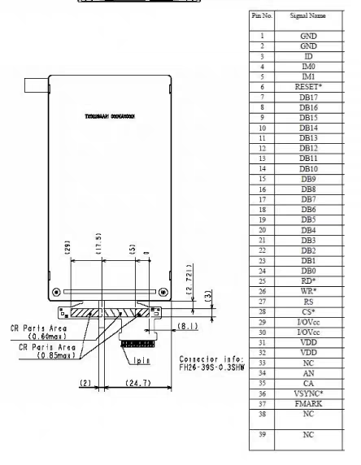

# S6D04D1X21-TFT-LCD-Display-Hardware

---

- 使用`STM32F103C8/BT6`开发，项目使用`STM32CubeMX`快速构建的，IDE使用的是`Keil v5`，但使用VSCode的扩展插件`EIDE`开发的。
- 屏幕背光使用的是15V供电，建议驱动板上设计一个`DC-DC`的`升压芯片`。
- 使用`8位模式`，需要把`IM0`、`IM1`都接GND，并行数据线引脚为`PA0-PA7`，适配市场上比较热销的STM32最小系统板引脚分布。
- 控制引脚为`PB5-PB8`，没有配置`RD`引脚连接，配置的控制引脚有`CS`、`RS`、`WR`、`RST`。
- 由于F103系列没有`FSMC/FMC`，所以我是使用`GPIO`模拟时序通讯的，稳定性还可以，杜邦线不要用太差的`(由其铁芯的)`。
- 注意开发板的`LDO`是否工作正常，如果刷屏的时候检测GPIO输出电压过低可能是由于`LDO`损坏，更换新的`LDO`或者使用`外部3.3V供电`。
- 切勿直接使用淘宝上盗版`ST-Link V2.1`的`3.3V供电`，屏幕有概率出现工作不正常，如出现类型情况，请先检测工作时LDO是否正常。
- PDD、TB有多家在卖这款屏幕，都是同一款的，但是有的店铺的屏幕四角背光有老化现象，有的没有，看运气，商家随机发的，我第一块就是背光有问题，然后测试的时候排线扯断了又买的新的，新的一点背光问题也没有，色彩显示也正常`(塞翁失马焉知非福😀)`。

---

## 该图为商家给的引脚定义图(34、35分别为LED_15V+和LED_15V-)

  

## 该图为效果测试图片

  
  
  

  
</video>

